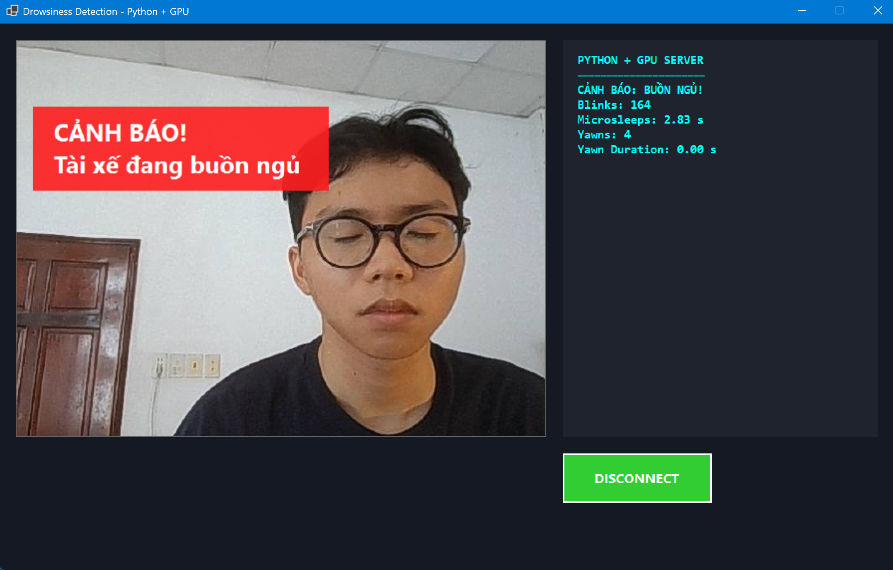
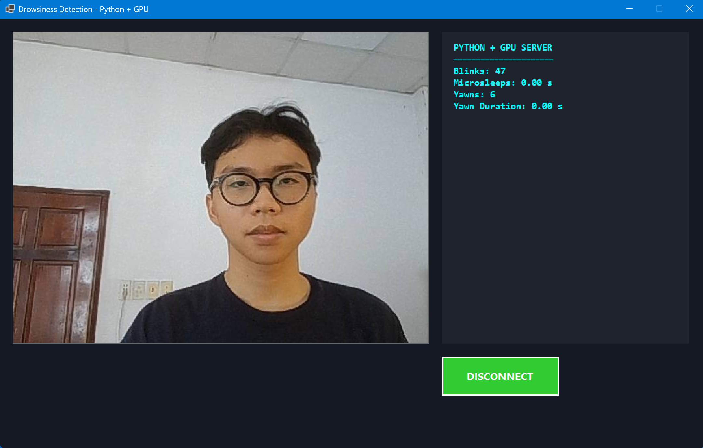

# 🚗 Real-Time Driver Drowsiness Detection


> A robust AI-powered system designed to prevent accidents by detecting driver fatigue in real-time using deep learning.

<div align="center"> 
  
  
</div>

## 📋 Table of Contents
- [Overview](#-overview)
- [Key Features](#-key-features)
- [System Architecture](#-system-architecture)
- [Tech Stack](#-tech-stack)
- [Installation & Setup](#-installation--setup)
- [Usage](#-usage)
- [Model & Data](#-model--data)
- [Directory Structure](#-directory-structure)

## 📖 Overview
This project implements a **Client-Server application** to monitor driver alertness. It utilizes a Convolutional Neural Network (CNN) to analyze webcam feeds frame-by-frame, classifying facial cues such as eye closure and yawning to trigger alerts when signs of drowsiness are detected.

## ✨ Key Features
* **Real-time Detection:** Low-latency processing using PyTorch (GPU accelerated).
* **Multi-State Classification:** Accurately identifies **Eyes Open**, **Eyes Closed**, and **Yawning**.
* **Hybrid Architecture:**  
  * **Backend:** Python AI processing engine.  
  * **Frontend:** C# Windows Forms for a user-friendly dashboard.
* **Advanced Metrics:** Tracks blink counts, yawn duration, and microsleep instances.
* **Audio Alerts:** Plays alarm sounds when dangerous fatigue levels are reached.

## 🏗 System Architecture

The system operates on a TCP/IP Client-Server model:

### 1. The Server (`server.py`)
* **Role:** The "Brain" of the system.
* **Function:** Captures video, detects faces using MediaPipe, and passes ROIs (Regions of Interest) to the CNN model.
* **Output:** Streams processed video frames and JSON metadata (drowsiness status, metrics) to the client via `127.0.0.1:9001`.

### 2. The Client (`DrowsinessClient.exe`)
* **Role:** The User Interface.
* **Function:** Connects to the server, renders the video stream, and visualizes health metrics.
* **Platform:** Built with C# (Windows Forms).

## 🛠 Tech Stack
* **Core Language:** Python 3.10  
* **Deep Learning:** PyTorch (CUDA 12.1 support recommended)  
* **Computer Vision:** OpenCV, MediaPipe  
* **GUI Client:** C# .NET Framework  
* **Environment:** Anaconda  

## ⚙️ Installation & Setup

### Prerequisites
* **NVIDIA GPU** (Recommended for real-time performance) with CUDA drivers installed.  
* **Anaconda** or Miniconda.  
* **Webcam**.

### Step 1: Environment Setup (Anaconda)
It is highly recommended to use Conda to manage dependencies and CUDA versions.

```bash
# 1. Create a new environment
conda create -n drowsy python=3.10

# 2. Activate the environment
conda activate drowsy
```

### Step 2: Install PyTorch (GPU)

Install the version compatible with your CUDA drivers (e.g., CUDA 12.1):

```bash
conda install pytorch torchvision torchaudio pytorch-cuda=12.1 -c pytorch -c nvidia
```

> **Note:** If your machine does not have NVIDIA drivers or CUDA Toolkit installed, install them before running PyTorch GPU.

### Step 3: Install Python Dependencies

```bash
pip install mediapipe opencv-python pygame
```

*Alternatively, if not using Conda:*

```bash
pip install -r requirements.txt
```

## 🚀 Usage

### 1. Start the AI Server

Navigate to the project directory and run the execution script:

```bash
python run.py
```

Expected output:

```text
[OK] Camera opened
Server running at 127.0.0.1:9001
```

### 2. Connect the Client

1. Open **`DrowsinessClient.exe`** (located in `DrowsinessClient/bin/Debug/` or root).  
2. Click **CONNECT TO**.  
3. The application will start streaming video and displaying fatigue metrics.

## 🧠 Model & Data

**Architecture:** Custom CNN-cls (Convolutional Neural Network for Classification).  
**Tasks:** Binary classification for Eyes (Open/Closed) and Yawning.

### Datasets Used

1. **Yawning:** YawDD Dataset — specialized video dataset for yawning detection.  
2. **Eyes:** MRL Eye Dataset — large-scale dataset of human eye images.

## 📂 Directory Structure

```text
.
├── alarm/                        # Audio files for alert sounds
├── DrowsinessClient/             # C# Client Source Code (Visual Studio Project)
├── runs/                         # Checkpoints & Training logs
├── hybrid_drowsiness_detector.py # Core AI Logic (Model inference class)
├── server.py                     # Socket Server & Video Processing Pipeline
├── run.py                        # Main Entry Point
├── requirements.txt              # Python Dependencies
└── README.md                     # Project Documentation
```

---

**Note:** Ensure your webcam is not being used by another application before starting the server.
